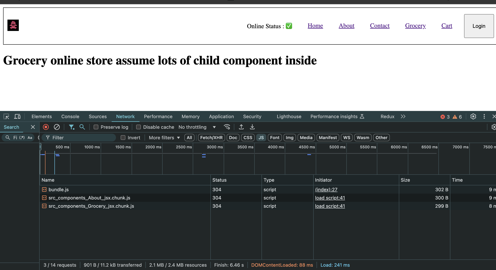

### config driven UI

Our website is driven by configs (comes from backend) ,
so basicilly UI is driven by data
Ex: swiggy api , offers shown in carousel for different loaction , will change wrt data

### Never use index as key

### Never keep hard coded data (URL,logo,strings) into your component file

Keep it inside separate file like config.js , utils or common or constant

### React is trying to solve this with efficient DOM manipulation => UI layer sync with Data layer with super powers of rendering on change of data

### Core logic of React is DOM manipulation

### React hook is a normal JS utility function given to us by react , it comes with superpowers

when ever a state var updates from anywhere in the app react will re-render a component

### useState()

- useState() - super powerful react variables, local var in a component (scope is in that component)

const [listOfRestaurants, setListOfRestaurants] = useState(resList);

its same as below

const arr = useState(resList)
//array destructuring
const [listOfRestaurants, setListOfRestaurants] = arr;
const listOfRestaurants = arr[0]
const setListOfRestaurants = arr[1]

notes:
\*\*\* Never create the state variable outside of the component, always call it inside component
\*\*\* Try to call the hooks on the top inside the component
\*\*\* Never create useState i.e state variable inside if else, for loops , insdie conditions , insdie functions

### useEffect()

- useEffect() - After the componenet renders useEffect is called.
  a) if no dependency array i.e useEffect is called on every component renders.
  b) if empty dependency array [] i.e useEffect is called on initial render and just once i.e when component is rendered for the first time.
  c)if [someting inside dependency array ] then useEffect will only be called if the dependency changes

### Reconciliation algo = React Fiber(New Reconciliation algo) (came in react 16 to update the DOM)

VirtualDOM = A javascript object (console any <Component/> , i.e a virtualDOM) it is representation of actual DOM or (JSX)
ActualDOM = 

DIFF algo = finds difference between two virtual DOMs (updated virtual DOM and previous DOM)and then actually update the DOM on the render cycle , it does not touch the DOM a lot that is why it is very fast

### fetch(): super power JS engine has, it will fecth data from API

### if there is origin mismatch browser gives CORS error , ex: we got CORS error when

### tried to hit swiggy API from local

### Loading is boaring now , \*\*\* use ShimmerUI from now onwards

### \*\* Whenever a state variable (we update it by using setter function ex: setData() from useState()) updates react re-renders a component

### createBrowserRouter is recommended for react (in documentation )

### 2 types of routing in webapps

1-> Client Side Routing (no network call , already all components are there , no page reloads also SPA)
2-> Server Side Routing (page reloads , i.e make network calls and html comes from server)

### Steps for Routing

1-> Inside index.js component ,
const appRoute = createBrowserRouter([{path:"/",element:<App/>,children:[{path:"/1",element:<Comp1/>},{path:"/1",element:<Comp1/>},{path:"/1",element:<Comp1/>}],errorElement:<Error/>)
2-> indide render (RouteProvider router={appRoute})

#### How react works in steps is what i have written below

\*\*\*MOUNTING LIFECYCLE

constructor (dummy)
Render (dummy data)

<HTML renders with dummy data>
componentDidMount (API call is made )
this.setState (state is updated so render in update cycle starts)

\*\*\*UPDATE CYCLE

Render(API data)

<HTML renders with new API data>
componentDidUpdate

### Optimisation Concept

-> Single Responsibility Principle (more resusable , testable , maintable)
-> Custom hooks

### LazyLoading == Chunking == code splitting == Dynamic bundling == ondemand loading == dynamic import

It will create a separate bundles for the lazy loaded components:
Ex: In our code we see different bundles for About & Grocery

#### //Note -> If we use state for showItems and hanlde its click in this component (ResCategory) then it will be uncontrolled here,

#### // so if we lift up the sate and use this showItems in parent Comp i.e RestaurantMenu then it will be controoled
